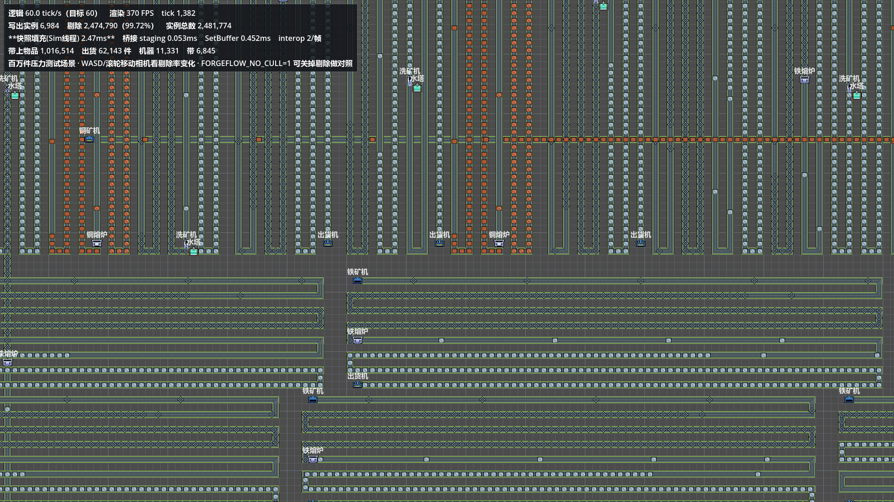
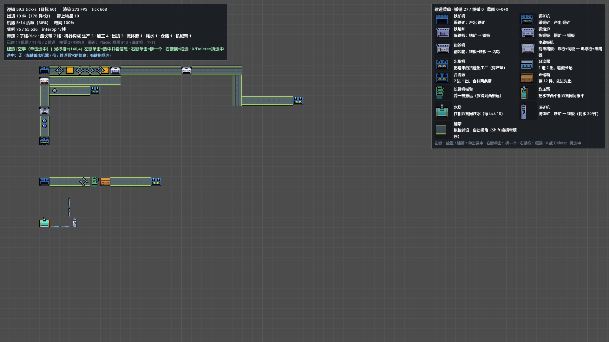

# ForgeFlow

**Godot 4.7 + C# 的 2D 流水线工厂模拟器。**

模拟内核是**完全 headless 的纯 C# 平坦数组** —— 不引 ECS、不引 JobSystem、不引任何第三方框架 ——
跑在自己的线程上按 **60Hz 固定步进**；渲染层每 tick 只向一个 `MultiMesh` 提交一次实例缓冲。

> **百万件物品在 145 万格传送带上：模拟侧 0.2~0.4 ms/tick，实机满 60.0 tick/s。**
> 而这套东西既没有用 ECS，也没有用多线程。



*百万件压力测试场景（`Scenes/Stress.tscn`）：2,850 条产线 / 11,331 台机器 / 6,845 条带 /
1,425 条管道，带上 **1,016,514 件**物品。左上角 HUD 是当场实测：剔除 99.72%、快照填充 2.47ms、60.0 tick/s。*



*从空地图搭出来的一条产线：铁线 / 铜线 / 电路板机的双输入 / 仓储箱 + 长臂机械臂跨格 /
水塔 + 管道 + 洗矿机。右上角建造菜单的每一项都写着名称与作用。*

---

## 一、这是什么

一个**能做出来、也能跑得动**的工厂建造游戏内核。玩法就是你熟悉的那套：铺传送带、摆机器、
按配方把矿石变成成品、再送进出货口。它的重点在**性能与确定性**，不在画面。

三层，依赖是单向的：

```
ForgeFlow.Sim/        模拟内核    纯 C#，零 Godot 引用，可脱离引擎独立跑
      ↓ RenderSnapshot（紧凑前缀 + 确定性哈希）+ SnapshotTripleBuffer（三缓冲）
Scripts/RenderBridge  渲染桥      认领快照 → 填 MultiMesh 缓冲 → 提交
      ↓
Scenes/Main.tscn      渲染        节点与资源全部预建
```

| 目录 | 内容 |
|---|---|
| [`ForgeFlow.Sim/`](ForgeFlow.Sim) | **模拟内核**（`FactorySim.*.cs` 按主题分了几个 partial 文件）。间隙模型 `Data/GapLine.cs` · 内容表 `Data/ContentDb.cs` · 可变拓扑 `Data/FactoryLayout.cs` |
| [`Scripts/`](Scripts) | `WalkingSkeleton.cs` 交互层 · `RenderBridge.cs` 渲染桥 · `CameraController.cs` · `SimLoopRunner.cs` · `StressRunner.cs` 压力场景 |
| [`Shaders/`](Shaders) | 图集逐实例 UV 着色器 · 网格底着色器 |
| [`Scenes/`](Scenes) | `Main.tscn` 主场景 · `Stress.tscn` 百万件压力场景 |

### 几条决定了整个设计的取舍

| 取舍 | 为什么 |
|---|---|
| **零框架**（无 ECS / JobSystem / 原生加速） | 实测 10,000 机器 + 9,000 带 + 电力 = **0.335 ms/tick**，比 3ms 门槛低一个数量级 ⇒ 不需要 |
| **间隙模型**：不存物品的绝对坐标，只存物品之间的间距 | 自由流动时每 tick 只碰 2 个整数；堵塞路径另有摊还游标，不会退化成 O(物品数) |
| **1-lane**：一条带一进一出，分叉/合流交给独立机器 | 跨带移交这件事直接消失 — 并行与确定性都变简单 |
| **模拟逻辑只用整数** | 同 seed 两遍快照哈希逐位一致（这就是存档与回放的地基） |
| **正确性由朴素参考实现守着** | `Reference/ReferenceLine.cs` 是间隙模型的唯一基准，逐 tick 逐项比对 |
| **节点与资源全部在场景里预建** | 脚本不 `new Node`；场景里看到的结构就是运行时的结构 |
| **内容是数据表，不是 `switch`** | 物品 / 配方 / 可建造项都在 `ContentDb` 里，加一种生产环节 = 加一行数据 |

**内容规模**：7 种物品、8 条配方（采铁矿 / 采铜矿 / 炼铁板 / 炼铜板 / 削齿轮 / 刻电路板 /
打铁箱 / 洗铁矿，其中洗铁矿耗水）、14 种可建造项 + 铺带。

### 实测（同一台机器上的实机数字）

| 项 | 规模 | 结果 |
|---|---|---|
| 模拟 · 百万件 | 4,000 带 × 250 格 = 1,000,000 件 | **0.2 ~ 0.4 ms/tick** |
| 模拟 · 百万件·堵塞 | 同上（间隙模型最坏路径） | **0.30 ms/tick** |
| 结构变更 | 单次放置 / 拆除 | **< 1 tick** |
| 渲染桥 | 100,000 实例 `SetBuffer` | **1.42 ms/帧** |
| 压力场景实机 | 1,016,514 件 / 1,452,504 带格 | 剔除 **99.72%**、**60.0 tick/s** |

---

## 二、怎么跑

### 前置

| 项 | 要求 |
|---|---|
| Godot | **4.7 的 .NET（mono）版**，例如 `Godot_v4.7-stable_mono_win64` |
| .NET SDK | 8.0（目标框架 `net8.0`） |
| 平台 | 目前只在 **Windows** 上验证过（`project.godot` 配的是 D3D12 + Forward+） |

### 构建

```powershell
dotnet build          # Debug —— Godot 编辑器用的就是这个配置
```

⚠ **别对 `.sln` 用 `-c Release`**：`ForgeFlow.sln` 里只有 Godot 自己的三个配置
（`Debug` / `ExportDebug` / `ExportRelease`），**没有 `Release`**，`dotnet build ForgeFlow.sln -c Release`
会直接报 `MSB4126: 指定的解决方案配置无效`。要 Release 就绕开解决方案、对工程文件构建：

```powershell
dotnet build ForgeFlow.csproj -c Release
```

### 跑主场景

用 Godot 编辑器打开本目录即可（**仓库根 = Godot 项目根**），或者直接命令行跑：

```powershell
& "<Godot 目录>\Godot_v4.7-stable_mono_win64_console.exe" --path "E:\GODOT\Project\ForgeFlow"
```

⚠ 用 `_console.exe` 才看得到 `GD.Print` 的输出。
⚠ `--headless` **不能**用于渲染测量（dummy renderer 测不到真实提交成本）。

### 跑百万件压力场景

```powershell
& "<Godot>_console.exe" --path "<仓库根>" --resolution 1920x1080 "res://Scenes/Stress.tscn"
```

场景启动时直接构造「压满」的初始状态，所以不用等几分钟让上游喂料 ——
它测的是「到了百万件之后每帧多少钱」。

### 空地图从零搭一条产线（不用手点）

```powershell
$env:FORGEFLOW_EMPTY='1'; $env:FORGEFLOW_AUTOBUILD='1'
& "<Godot>_console.exe" --path "<仓库根>" --resolution 1920x1080
```

它会脚本化搭出一条完整产线并打印核对行（机器 / 带 / 管道 / 接受 / 拒绝的条数）。

### 想看回归测试

⚠ **16 个回归探针不在本仓库里**（`ForgeFlow.Sim.Probes/` 未纳入版本控制），
所以上表那些数字对克隆者只是记录、不能就地复现。若你拿到了那个工程：

```powershell
dotnet run --project ForgeFlow.Sim.Probes -c Release -- all
```

---

## 三、怎么用

| 操作 | 行为 |
|---|---|
| `WASD` / 方向键 | 平移（速度按缩放折算） |
| 滚轮 | **以光标为锚点**缩放，0.01 ~ 4（能一路拉到全景） |
| 中键拖拽 | 抓取平移 |
| `Home` / `F` | 复位取景 |
| `1`-`9`、`0`、`-`、`=` | 选建筑（等同点右上角建造菜单） |
| `B` | 铺带（**拖拽**；斜着拖自动拆成两段直角带，`Shift` 换拐弯顺序） |
| `T` | 切换铺带的**层**（低轨贴地 / 高轨架在上面）；不按也行 —— 拖过已有轨道会自己走高轨 |
| `R` | 旋转朝向（只在放置模式下有意义） |
| 左键单击（选了建筑） | 放置；**压在已有东西上时改成「选中」** |
| 左键单击（空手） | 选中鼠标下的机器 / 带 / 管道，HUD 显示实时信息 |
| **右键单击** | **拆掉鼠标下那一个** —— 不需要任何模式 |
| **右键按住拖拽** | **框选**；被选中的物块自己变亮，松开后仍看得出选中了哪些 |
| `X` / `Delete` | 拆掉当前选中的（框选拆整片，单击拆那一个） |
| `Ctrl+C` / `Ctrl+V` | 复制框选区域 / 蓝图粘贴 |
| `Ctrl+Z` / `Ctrl+Y` | 撤销 / 重做 |
| `Esc` | 回空手 |
| 点一台机器 | 打开**轨道选择器**，给它绑输入轨 / 输出轨 |

**上手三步**：① 用建造菜单（或数字键）放一台采矿机 → ② 按 `B` 从它拖一条带出来 →
③ 在带末端放一台熔炉。机器**必须接线才会工作**：点它，在右下角轨道选择器里把输入/输出轨绑上。

**建造菜单**：14 种可建造项 + 铺带 = 15 个图标按钮，每一项都写着名称与作用
（作用是由配方推导出来的，不是手写说明）。

### 常用的环境变量

| 变量 | 作用 |
|---|---|
| `FORGEFLOW_EMPTY=1` | 空地图开局 |
| `FORGEFLOW_AUTOBUILD=1` | 脚本化搭一条完整产线并打印核对行 |
| `FORGEFLOW_PROBE=1` | 每秒打印 fps / tick / 提交耗时 / interop 次数 |
| `FORGEFLOW_AUTOEXIT=<秒>` | 到点自动退出（自动化跑测） |
| `FORGEFLOW_SIMSEQ="key:R;click:10,10;drag:7,4,13,4;..."` | 脚本化输入序列（走**真实输入管线**） |
| `FORGEFLOW_SIM=factory\|belt\|trivial` | 换模拟实现（证明渲染层与模拟实现解耦） |
| `FORGEFLOW_SCREENSHOT=<路径>` + `_AT=<秒>` | 抓一张视口截图 |
| `FORGEFLOW_NO_CAMERA=1` / `FORGEFLOW_ZOOM=<n>` | 固定相机，让截图与跑测数字可复现 |

---

## 四、许可

**代码：MIT** —— 见 [`LICENSE`](LICENSE)。可自由使用、修改、分发、商用。

⚠ **美术素材不在 MIT 覆盖范围内**，它们各自有独立的许可：

当前在用 **[sierrassets — Pixel Art Automation Tileset](https://sierrassets.itch.io/automation-tileset)**
（32×32，图集 `assets/automation pack/automation spritesheet.png`）。
**它是自定义许可、不是 CC0**：用于做游戏（含商业）允许，但**不得转售素材包本身**。
原文与逐格映射见 [`assets/CREDITS.md`](assets/CREDITS.md) —— 那一份才是素材的合规凭证。

⇒ 也就是说：**你可以用 MIT 的条款使用这份代码，但其中的图集仍受原作者许可约束**
（例如不能把图集本身拿去转售）。要发布自己的版本，请先读 `assets/CREDITS.md`。
